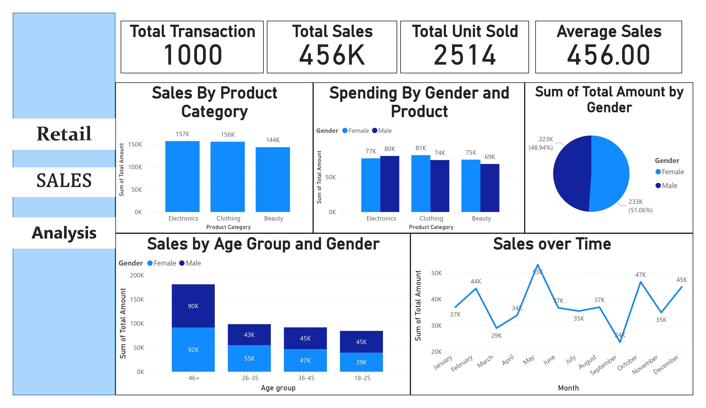

# Retail Sales Analysis Project

## Project Overview

This project focuses on analyzing retail sales data to extract valuable insights and visualize sales trends. It includes data cleaning, preprocessing, exploratory data analysis (EDA), and creating interactive dashboards to help stakeholders make informed business decisions.

## Key Components

### 1. **Data Cleaning and Preprocessing**

- **Tools Used:** Python, Pandas
- **Process:**
  - Handled missing and duplicate values.
  - Converted data types for efficient analysis.
  - Performed outlier detection and correction.
  - Created new features, including calculated metrics like total sales per transaction.

### 2. **Exploratory Data Analysis (EDA)**

- **Tools Used:** Python, Pandas, Matplotlib, Seaborn
- **Process:**
  - Analyzed sales trends by time (daily, monthly, and yearly).
  - Examined customer demographics, purchasing patterns, and preferences.
  - Identified top-selling products and high-revenue categories.
  - Detected seasonality and peak sales periods.

### 3. **SQL Queries for Key Insights**

- **Tools Used:** SQL
- **Key Insights Extracted:**
  - Top-selling products by revenue and units sold.
  - Sales by region and customer segment.
  - Average purchase value and quantity trends.
  - Customer retention and repeat purchases.

### 4. **Interactive Dashboards**

- **Tools Used:** Power BI / Excel
- **Dashboard Features:**
  - **Sales Overview:** Visualizing total revenue, sales trends, and comparisons over time.
  - **Top-Selling Products:** Displaying the most profitable products and categories.
  - **Customer Analysis:** Highlighting demographic information and purchasing behavior.
  - **Geographical Analysis:** Mapping sales by region, city, or store location.
  - **Seasonality Trends:** Interactive charts showing sales peaks during key periods.

## Power BI Dashboard

Below is an example of the interactive Power BI dashboard created for this project:

 

This dashboard visualizes:
- Total sales trends over time.
- Top-selling products and categories.
- Sales by region and customer demographics.

## Dataset

- **Source:** Retail Sales Dataset
- **Columns:**
  - Transaction ID
  - Date
  - Customer ID
  - Gender
  - Age
  - Product Category
  - Quantity
  - Price per Unit
  - Total Amount

## Expected Outcome

This project aims to help businesses understand their sales data, identify opportunities for growth, and optimize product offerings. The final dashboard provides stakeholders with a user-friendly interface to track sales performance and make data-driven decisions.

## How to Run the Project

1. **Data Cleaning & Preprocessing:**
   - Run the Python script to clean and preprocess the dataset.
   - Use `Pandas` for efficient data manipulation.

2. **EDA & SQL Queries:**
   - Use Python for EDA visualizations and summary statistics.
   - Run SQL queries to extract key sales insights.

3. **Power BI Dashboard:**
   - Import the cleaned dataset into Power BI or Excel.
   - Follow the steps to create and interact with the visualizations.

## Conclusion

This project demonstrates the power of data analysis in retail sales. By leveraging Python for data preprocessing, SQL for querying, and Power BI for visualization, we can deliver actionable insights to improve decision-making and optimize business strategies.
